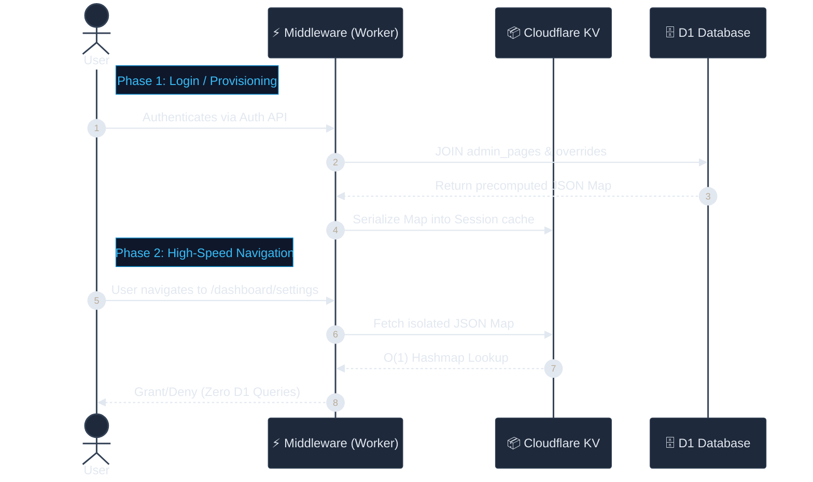
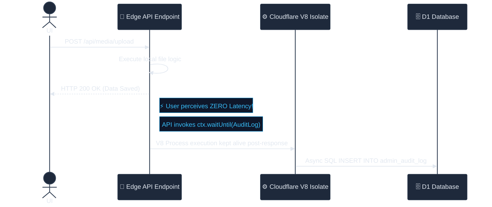

# 🛡️ System Architecture: RBAC, PLAC & Ghost Audit

> [!NOTE]
> **System Status:** Production Ready 
> **Target Environment:** Cloudflare Workers V8 Isolates (Edge Computing)
> **Last Updated:** April 2026

This document outlines the complete technical implementation, database schema integration, execution lifecycle, and operational rules for the **CF-Admin Security & Tracing Triad**: Hierarchical RBAC, Page-Level Access Control (PLAC), and the Ghost Audit Engine.

Designed specifically to operate within Cloudflare's strict 10ms–50ms CPU limits, this triad provides enterprise-grade administrative security with **zero user-perceived latency** and an effective **$0 infrastructure cost**.

---

## 1. The RBAC Foundation (Role-Based Access Control)

RBAC forms the "natural baseline" of the CF-Admin authentication system. It assigns an absolute integer weight to users, establishing a rigid command hierarchy.

### 1.1 The Role Hierarchy Matrix

Defined centrally in `src/lib/auth/rbac.ts`, roles are scored such that a **lower number equals higher privilege**. Any permission check evaluates if `ActorLevel <= TargetLevel`.

| Level | Role | Identifier | Capabilities | Badge UI | Target Audience |
| :---: | :--- | :--- | :--- | :---: | :--- |
| **0** | **DEV (Ghost)** | `dev` | **Absolute System Supremacy.** Can execute database prunes, mutate other devs, and view raw cryptolocked logs. Hidden entirely from lower tiers. | ⚡ Red | System Architects |
| **1** | **Super Admin** | `super_admin` | **Owner-Level Access.** Can manage users, alter global settings, and grant privileges *at or below* their natural level. | 👑 Gold | Business Owners |
| **2** | **Admin** | `admin` | **Manager-Level Access.** Can manage content (Hero, Gallery, Reviews), view customers, and read generalized audit logs. | 🛡️ Purple | Operations Managers |
| **3** | **Staff** | `staff` | **Restricted Access.** Designed for read-only operations and basic daily front-desk interactions. | 👤 Blue | Front Desk & Support |

### 1.2 The Hardcoded Emergency Fallback

> [!CAUTION]
> **Anti-Lockout Mechanism**
> To prevent catastrophic administrative lockouts (e.g., if D1 drops, migrations fail, or a vicious actor strips rights), the system relies on a hardcoded array of `SUPER_ADMIN_EMAILS`.

```typescript
export const SUPER_ADMIN_EMAILS = [
  'harshil.8136@gmail.com', 
  'team@madagascarhotelags.com'
] as const;
```

If an authenticated email matches the array above, the Cloudflare worker natively forces `super_admin` properties during token minting, bypassing the D1 role validation entirely.

---

## 2. Page-Level Access Control (PLAC)

While RBAC handles broad categorization natively, **PLAC** is a high-performance database extension that allows explicit **Granting** or **Denying** of single pages inside the dashboard on a *per-user* basis. It acts as the absolute final authority determining if a UUID can view a specific `/dashboard/*` route.

### 2.1 The "Compute on Write, Read from Cache" Pipeline

Querying D1 for page permissions on every single navigation event would consume 3–5ms of CPU time per click and create thousands of unnecessary SQL reads. PLAC avoids this entirely.



### 2.2 The D1 Schema Integration

PLAC relies on two specific tables tightly entwined via Foreign Keys:

* **Table A: `admin_pages`** (The Source of Truth for Routing)
  Defines every page that exists in the interface (`path`, `required_role`, `is_active`).

* **Table B: `admin_page_overrides`** (The Delta State)
  Holds specific overrides from the natural hierarchy via composite keys (`user_id` + `page_path`) and a boolean `granted` parameter.

### 2.3 The "Deny Wins" Resolution Algorithm

When the `computeAccessMap` function fires, it resolves the permissions down to a boolean through strict precedence logic (where O(n) = number of pages):

1. **Explicit DENY (`0`) Overrides:** ACCESS IS BLOCKED. Denies instantly overwrite the natural hierarchy.
2. **Explicit GRANT (`1`) Overrides:** ACCESS IS ALLOWED. 
3. **Implicit Role Default:** If no override row exists, the system relies on baseline mathematics: `user.RoleLevel <= page.RequiredLevel`.

### 2.4 Provisioning Gatekeepers (Anti-Escalation Measures)

> [!IMPORTANT]
> The API endpoint handling Access Management (`POST /api/users/access`) contains four ironclad validation gates. Without them, a standard Admin could theoretically grant themselves Dev permissions.

* **Gate A: Rank Supremacy (`actorLevel < targetLevel`)**
  Administrators can never manipulate the access array of users at their own level or higher.
* **Gate B: DEV Ghosting**
  Users with the `dev` rank are intentionally dropped from UI payloads when requested by non-devs. The DEV cohort operates completely invisibly to standard administration.
* **Gate C: Page Visibility Check (`actorHasPage === true`)**
  Administrators cannot grant another user access to a page they cannot see themselves.
* **Gate D: Natural Ceiling Enforcement**
  Administrators cannot grant a Staff member access to a tool designed with a `dev` base requirement. Grants are capped at the actor's maximum clearance level.

### 2.5 Auto-Purging Strategies

* **Instant Discontinuation:** Modifying a user's PLAC map calls `forceLogoutUser(kv, targetId)`. Explicitly deleting the target's KV prefix triggers a cache miss on their next request, instantly forcing the new D1 rules to evaluate.
* **Role Promotion Reset:** Changing a user's natural baseline role immediately triggers a `DELETE FROM admin_page_overrides`. A new role implies a new baseline; historical granular rules are destroyed to maintain logical database cleanliness.

---

## 3. The Ghost Audit Engine

The Ghost Audit Engine is the overarching forensic surveillance system covering `cf-admin`. Because we do not rely on a monolithic backend, traditional blocking loggers would severely degrade Edge performance. The Ghost Engine resolves this.

### 3.1 The Concept: `ctx.waitUntil`

Writing to a physical D1 SQL database takes approximately 5ms to 15ms. Waiting for an audit log to spool before completing a request destroys perceived application speed.

**Solution:** Cloudflare's `ExecutionContext.waitUntil(promise)`.



The user experiences unparalleled performance, while the security ledger remains mathematically uncompromised. Since Cloudflare V8 limits primarily govern the *HTTP response phase*, these background operations execute at effectively zero cost.

### 3.2 Immutability at the Edge

> [!WARNING]
> The `admin_audit_log` table explicitly allows `SELECT` and `INSERT`. **The API layer exposes NO `DELETE` or `UPDATE` endpoints.** 

To modify a log, a malicious actor would require Cloudflare Dashboard-level administrative access to run raw D1 queries via the CLI. At the framework level, the ledger is computationally immutable. *(Note: `prune.ts` periodically flushes logs older than 6 months strictly into cold storage to maintain D1 sizing limits).*

### 3.3 Privacy-Preserved Traceability (Edge IP Hashing)

We must trace if a singular geographic IP address is repeatedly attacking the API, but storing raw IPv4 data permanently violates global data privacy regulations (GDPR/LFPDPPP). 

The `hashIP()` function solves this at the edge via **cryptographic blinding**:

1. `cf-connecting-ip` is stripped from the request header natively.
2. It is bound to a hardened Environment Secret (`IP_HASH_SECRET`).
3. An **HMAC-SHA256 signature** is spawned via the V8 WebCrypto API.
4. The result is safely truncated to 12 hex characters.

**The Privacy Result:** We can perfectly group abusive traffic *(e.g., "Hash `a4f89d` submitted 500 failed gallery uploads")* without ever saving the raw IP address. It neutralizes privacy liabilities even if the D1 database is entirely compromised. *(Note: Raw SHA-256 is insufficient here; the minimal 4.3B IPv4 space is easily cracked via rainbow tables. HMAC protects the signature).*

### 3.4 Operational Payload Tracking

The engine specifically tracks unified JSON payloads representing every state mutation in the administrative ecosystem:

* **Identity Signatures:** `user_id`, `user_email`, `user_role`
* **Behavior Vectors:** `action` (e.g., `login`, `revoke_access`, `update`), `module` (e.g., `plac`, `content`, `auth`)
* **Impact Vectors:** `target_id`, `target_type`, `details` *(granular JSON tracking of exact element changes)*
* **Environment Vectors:** `ip_hash`

By implementing this factory on every mutating API (`POST`, `PUT`, `DELETE`), CF-Admin provides enterprise-grade observability completely native to Cloudflare's serverless footprint.

### 3.5 Ubiquitous Navigational Telemetry (Middleware Tracking)

> [!TIP]
> **The "In-Accessible Page" Tracer**
> Traditional audit logs only track successful API actions. CF-Admin intercepts navigations at the core Astro `middleware.ts` to log both permitted views and **malicious probing**.

Every non-API navigation inside the dashboard is intercepted:

1. **Access Evaluation:** The middleware checks the PLAC map.
2. **Synchronous Transition:** The user is either allowed to load the page or intercepted and bounced to a `403` error screen.
3. **Ghost Telemetry:** The middleware fires an async `ctx.waitUntil()` task pushing an `action: 'view'` ledger entry. 

Crucially, the `details` payload contains `granted: boolean`. This allows Devs to scan the audit table for `granted: false` to instantly uncover if a staff member was repeatedly attempting to access `/dashboard/settings` or restricted endpoints, providing holistic behavioral monitoring beyond just successful database mutations.
