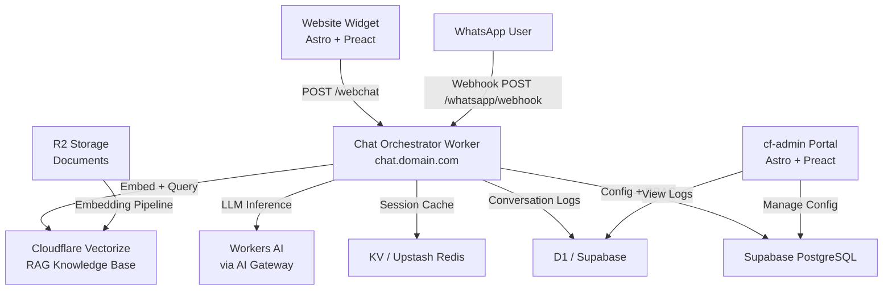

# AI Chatbot Architecture for WhatsApp and Website on Cloudflare Free Tier

## Table of Contents

- [Overview](#overview)
- [Key Platform Constraints and Pricing](#key-platform-constraints-and-pricing)
  - [Cloudflare Workers and Workers AI](#cloudflare-workers-and-workers-ai)
  - [Cloudflare Vectorize and RAG](#cloudflare-vectorize-and-rag)
  - [WhatsApp Cloud API Pricing Reality](#whatsapp-cloud-api-pricing-reality)
- [High-Level Architecture](#high-level-architecture)
  - [Logical Components](#logical-components)
  - [Architecture Diagram](#architecture-diagram)
  - [Deployment Topology](#deployment-topology)
- [Conversation Flow for the Website Chatbot](#conversation-flow-for-the-website-chatbot)
  - [Client-Side Integration (Astro + Preact)](#client-side-integration-astro--preact)
  - [Server-Side Orchestration (Worker)](#server-side-orchestration-worker)
- [Conversation Flow for WhatsApp](#conversation-flow-for-whatsapp)
  - [WhatsApp Cloud API Webhook Handling](#whatsapp-cloud-api-webhook-handling)
  - [Cost Minimization Strategies for WhatsApp](#cost-minimization-strategies-for-whatsapp)
- [Data, Storage, and RAG Design](#data-storage-and-rag-design)
  - [Content Sources and Synchronization](#content-sources-and-synchronization)
  - [Vector Schema and Query Strategy](#vector-schema-and-query-strategy)
- [Configuration and Admin Experience (cf-admin)](#configuration-and-admin-experience-cf-admin)
  - [Configuration Model](#configuration-model)
  - [Logging, Audit, and Monitoring](#logging-audit-and-monitoring)
- [Security and Privacy](#security-and-privacy)
  - [Edge Security](#edge-security)
  - [Data Protection](#data-protection)
  - [Abuse and Rate Limiting](#abuse-and-rate-limiting)
- [Cost Optimization Summary](#cost-optimization-summary)
- [Implementation Roadmap](#implementation-roadmap)
- [References](#references)

---

## Overview

This report designs an industry-standard architecture for a shared AI chatbot that serves both a business website and a WhatsApp Business number while keeping all infrastructure (except Cloudflare AI model usage and unavoidable WhatsApp fees) on free tiers.
The design targets a Cloudflare-centric stack (Workers, D1, R2, KV, Upstash, Vectorize, Supabase) with a secure cf-admin portal controlling configuration, logging, and observability for the chatbot.

The primary goals are:

- Use Cloudflare Workers AI as the only paid AI service, staying mostly within the free 10,000 neurons/day and scaling predictably beyond that.[^1]
- Use the Cloudflare Workers Free plan plus existing services (D1, KV, R2, Upstash Redis, Supabase) for state, RAG, and configuration.
- Integrate directly with WhatsApp Cloud API to avoid third-party BSP markups, acknowledging that Meta's per-message pricing is unavoidable but can be minimized by structuring messaging as service conversations.[^2][^3][^4]
- Provide a unified conversation engine for both web and WhatsApp with centralized security, audit logging, and admin-controlled behaviour.

---

## Key Platform Constraints and Pricing

### Cloudflare Workers and Workers AI

Cloudflare Workers AI is priced at approximately $0.011 USD per 1,000 neurons, with a free allocation of 10,000 neurons per day on both Free and Paid plans.[^1]
Each LLM model has different neuron-per-token characteristics, but small and mid-size models (for example, 1–8B parameters) remain inexpensive at typical chat token lengths for SMB use.
This allows prototyping and low-volume production on the free allocation and predictable scaling once request volume grows.[^5][^1]

Workers Free tier supports 100,000 requests per day and a limited amount of CPU time, which is generally sufficient for an SMB chatbot as long as heavy compute is offloaded to Workers AI and caching is used.[^6]
Higher sustained volume may require upgrading to the Workers Paid plan at $5 USD per month, which includes much larger request and CPU quotas.[^7][^6]

### Cloudflare Vectorize and RAG

Cloudflare Vectorize pricing is based on "stored dimensions" (vector count × dimension) and "queried dimensions."[^8]
A separate estimator describes that Workers Free includes roughly 30 million queried vector dimensions and 5 million stored vector dimensions per month, with pricing beyond that at $0.01 USD per million queried dimensions and $0.05 USD per 100 million stored dimensions.[^9]
This free tier is enough for a significant knowledge base (tens of thousands of short documents with 384–1,024-dimensional embeddings) and tens of thousands of queries per month.

Cloudflare's documentation and community answers emphasize that Vectorize remains available within the Workers Free tier for prototyping and light production workloads, though high-volume use benefits from Workers Paid.[^10][^11][^8]
This makes Vectorize appropriate as the default vector store for RAG in this architecture.

### WhatsApp Cloud API Pricing Reality

Meta has shifted WhatsApp Business API from purely conversation-based pricing to a per-message model, with different rates by country and message category.[^4][^2]
Service messages sent within a 24-hour customer service window initiated by the user are free and unlimited; marketing, utility, and authentication templates are charged per message with volume tiers.[^3][^2]
Additionally, the first 1,000 customer-initiated conversations per month are typically free for Cloud API accounts, after which Meta's per-message fees apply.[^12]

Third-party Business Solution Providers (BSPs) add their own per-message or per-conversation surcharges on top of Meta's base rates.[^2][^12]
To keep costs minimal, this architecture assumes direct use of the official WhatsApp Cloud API from Meta (no Twilio, Gupshup, or other BSP), accepting that WhatsApp itself cannot be free but avoiding any extra middleman pricing.

---

## High-Level Architecture

### Logical Components

At a high level, the system is composed of:

- **Channel entrypoints**
  - Website chatbot widget (Astro + Preact, hosted on existing sites).
  - WhatsApp Business number via WhatsApp Cloud API webhooks.
- **Edge orchestration**
  - Cloudflare Worker "Chat Orchestrator" handling all inbound messages, normalizing them, and calling the LLM + RAG pipeline.
  - Optional AI Gateway in front of Workers AI for free observability, rate limiting, retries, and caching.[^7]
- **Data and configuration**
  - D1 or Supabase for conversation logs, message transcripts, and analytics.
  - Cloudflare Vectorize (plus Workers AI embedding models) for semantic knowledge base / RAG.[^8][^9]
  - KV / Upstash Redis as cache for recent sessions and hot conversation state.
  - R2 for storing raw documents or FAQ exports that are embedded into Vectorize.
  - Supabase tables for chatbot configuration (prompts, behaviour flags, RBAC-controlled overrides) managed via cf-admin.
- **Admin portal**
  - cf-admin (Astro + Preact on Workers) as the single control panel for configuration, audit log viewing, and per-channel tuning, leveraging your existing RBAC, Supabase, and audit logging patterns.

### Architecture Diagram

### Deployment Topology

- The Chat Orchestrator Worker is deployed in the same Cloudflare account as the rest of the stack, routed via a dedicated subdomain such as `chat.madagascarhotelags.com`.
- Two primary endpoints are exposed:
  - `/webchat` for website POST requests (and optional SSE/streaming).
  - `/whatsapp/webhook` for WhatsApp Cloud API webhooks.
- Internal requests (e.g., from cf-admin) interact with the Worker via private routes or service bindings, ensuring configuration and analytics APIs are not publicly discoverable.

---

## Conversation Flow for the Website Chatbot

### Client-Side Integration (Astro + Preact)

The website chatbot can be implemented as a Preact island embedded on the main marketing site.
The client UI maintains a local chat transcript and sends messages to the Chat Orchestrator via `fetch` (and optionally receives streaming responses via `EventSource` or Fetch streaming).
This mirrors patterns you have already used for rich but fast JS-driven chat UIs.

Key responsibilities on the client:

- Manage UI state, message list, typing indicators, and error states.
- Attach metadata (session ID, channel = `web`, user agent, language) in the payload.
- Apply rate limits and UX-level cooldowns to prevent abuse.
- Securely store only anonymous identifiers in the browser unless the user is authenticated.

### Server-Side Orchestration (Worker)

For an incoming web chat message:

1. **Authenticate / identify session**
   - For anonymous visitors, generate or re-use an opaque session ID linked to cookies or headers.
   - For logged-in admins or staff (if the chat is used internally), attach authenticated user IDs and roles.
2. **Apply channel-aware policies**
   - Check per-channel configuration (enabled features, temperature, max tokens, allowed tools) from KV or Supabase.
   - Enforce per-IP and per-session rate limits using Upstash Redis or Workers AI Gateway if configured.[^7]
3. **Retrieve conversation context**
   - Load the last N messages from D1 or Supabase for that session.
   - Truncate or summarize older messages to stay within LLM context limits.
4. **RAG: retrieve relevant knowledge**
   - Embed the user query with a Workers AI embedding model such as `@cf/baai/bge-small-en-v1.5`, which has low cost and good English performance.[^1]
   - Query Cloudflare Vectorize for top-K documents based on cosine similarity, staying within free-tier dimensions.[^9][^8]
   - Optionally augment with lexical filters (e.g., tags for "pricing", "pet policies", "location").
5. **Construct model prompt**
   - System prompt tuned to "friendly, smart Madagascar Pet Hotel assistant" with channel-specific constraints.
   - Messages from conversation history and top-K RAG snippets.
   - User message appended as the final input.
6. **Call Workers AI**
   - Use a cost-effective chat model (for example, a 3–8B parameter Llama or Granite model) to balance cost and quality; Cloudflare's per-token costs for these models remain low at SMB scale.[^5][^1]
   - Optionally route through AI Gateway for logging, caching, and retries.[^7]
7. **Post-processing**
   - Strip or neutralize hallucinated URLs or policies that conflict with your canonical business rules.
   - Optionally apply rule-based safety filters to detect and redact sensitive personal data.
8. **Persist logs**
   - Write the message, model call metadata (model name, tokens, latency, cost estimate), and RAG document IDs into D1 or Supabase.
   - Store a summarized or hashed representation for long-term analytics while keeping full text only as long as necessary for debugging and audits.
9. **Return response**
   - Stream tokens back to the Preact client where possible for fast perceptual latency.
   - Include metadata (answer source: knowledge base vs. general, confidence, document IDs) for optional client UI indicators.

---

## Conversation Flow for WhatsApp

### WhatsApp Cloud API Webhook Handling

WhatsApp Cloud API delivers incoming messages via HTTPS POST webhooks containing the sender's phone number, message body, and metadata.[^12]
When a message is user-initiated, it opens a 24-hour customer service window during which service messages and certain utility templates are free.[^3][^2]

For each webhook:

1. **Verify request authenticity**
   - Validate Meta's signature header using the app secret to prevent spoofing.
   - Process only POSTs to `/whatsapp/webhook` and reject everything else.
2. **Normalize payload**
   - Extract phone number, message ID, language, and text content.
   - Derive or create a conversation ID per phone number (and optionally per WhatsApp Business number if multiple are used).
3. **Apply channel policies**
   - Use `channel = whatsapp` config from cf-admin for:
     - Allowed reply types (pure text, links, short structured lists).
     - Maximum message length to avoid multi-part messages.
     - Whether to allow proactive outbound templates or only respond within service windows.
4. **Reuse the same RAG + LLM pipeline**
   - Call the same Chat Orchestrator internal logic as the website channel, but with WhatsApp-specific system prompt instructions (shorter responses, WhatsApp-safe formatting, no HTML).
5. **Send reply via WhatsApp Cloud API**
   - Use WhatsApp's `messages` endpoint with type `text` or `interactive` for structured replies, respecting free service window rules to minimize billing.[^4][^2][^3]
   - Never send marketing templates automatically; require explicit admin action if ever needed.
6. **Log and audit**
   - Persist inbound and outbound messages, including WhatsApp message IDs, to D1 or Supabase.
   - Mark each message with pricing-related metadata (e.g., category guess: service vs. utility) based on your usage patterns to estimate costs.

### Cost Minimization Strategies for WhatsApp

To keep WhatsApp costs as low as realistically possible:

- **Respond only to user-initiated messages** where possible so replies count as service messages within the free customer service window.[^2][^3]
- Avoid outbound marketing templates from the chatbot; reserve such flows for manual campaigns where the incremental value justifies the cost.
- Keep replies concise, respecting user context but avoiding long multi-part messages that multiply per-message charges in some markets.[^2]
- Use internal analytics in cf-admin to monitor per-country volume and message categories to detect if any pricing changes require reconfiguration.

---

## Data, Storage, and RAG Design

### Content Sources and Synchronization

The chatbot should ground its responses primarily in:

- Canonical content managed via cf-admin (room types, pricing rules, pet policies, operating hours, contact details).
- Booking and user data where needed (for authenticated queries and booking status lookups).
- Optional additional knowledge sources such as FAQs, blogs, or internal SOPs.

Recommended storage mapping:

| Store | Role |
|-------|------|
| **Supabase PostgreSQL** | Canonical configuration and structured content your admin portal already manages. |
| **R2** | Markdown, HTML, or JSON exports of content for embedding (e.g., a nightly job generates `kb/*.md`). |
| **Vectorize** | Embeddings of those documents, keyed by content type, locale, and entity IDs. |
| **D1** | High-volume conversation logs and analytics events where latency benefits from edge proximity. |

A scheduled Worker (or cf-admin-triggered job) can periodically:

- Fetch updated content from Supabase.
- Generate embeddings via Workers AI embedding models.
- Upsert vectors into the Cloudflare Vectorize index.

This workflow reuses the same Workers AI billing as your chatbot but amortizes it over relatively infrequent updates.[^9][^1]

### Vector Schema and Query Strategy

For Vectorize:

- Choose an embedding model like `@cf/baai/bge-small-en-v1.5` or `bge-base-en-v1.5` for good quality at low cost and 384–768 dimensions.[^1]
- Use a schema where each vector record includes:

| Field | Description |
|-------|-------------|
| `id` | Stable key referencing the CMS or content entry |
| `type` | Content category, e.g., `policy`, `amenity`, `booking-faq` |
| `language` | ISO language code for locale-aware filtering |
| `source_url` / `cms_path` | Origin reference for traceability |
| `metadata` | JSON string with tags like `pet`, `payment`, `location` |

- Query strategy:
  - Embedding similarity on the user query.
  - Filtering by language and channel if needed.
  - Returning top K = 3–8 documents.

This keeps both stored dimensions and queried dimensions within the free Vectorize tier for small to medium knowledge bases.[^9]

---

## Configuration and Admin Experience (cf-admin)

### Configuration Model

Given cf-admin's RBAC layers (DEV → SuperAdmin → Admin → Staff) and strong audit logging, it is a natural control plane for the chatbot.
Recommended configuration tables in Supabase:

#### `chatbot_channels`

| Column | Type / Notes |
|--------|--------------|
| `id` | UUID primary key |
| `name` | Channel name — `web` or `whatsapp` |
| `enabled` | boolean — whether the channel is active |
| `llm_model` | Workers AI model identifier string |
| `temperature` | float — LLM sampling temperature |
| `max_tokens` | integer — maximum tokens per response |
| `top_p` | float — nucleus sampling parameter |
| `allow_rag` | boolean — whether RAG is enabled for this channel |
| `rag_top_k` | integer — number of top documents to retrieve |
| `rag_sources` | text array — allowed content source types |

#### `chatbot_prompts`

- System and developer prompts, versioned and tagged.
- Channel-specific overrides (e.g., shorter style for WhatsApp).

#### `chatbot_rate_limits`

- Per-channel, per-user, per-IP rules.
- Burst vs. sustained limits.

#### `chatbot_integrations`

- WhatsApp Cloud API credentials and webhook verification tokens.
- Flags to enable or disable proactive templates.

#### `chatbot_analytics_views` (database views)

- Aggregated metrics: conversations per day, average tokens, resolution rates, fallback counts.

cf-admin pages can expose:

- Channel overview and on/off toggles.
- Prompt editor with preview and RBAC (only SuperAdmin can modify system prompts).
- Rate-limit configuration UI.
- Key rotation and webhook secret management (DEV / SuperAdmin only).
- Analytics dashboards using Supabase SQL views and client-side charts.

### Logging, Audit, and Monitoring

To align with your existing audit logging standards:

- Log every inbound and outbound chatbot message into a dedicated table with:
  - `channel`, `user_identifier` (phone or session ID), `timestamp`.
  - `message_direction` (inbound/outbound), `raw_text`.
  - `rag_documents` (IDs of documents used in the response).
  - `llm_model`, estimated `tokens_in`, `tokens_out`, and approximate cost.
- Use Cloudflare AI Gateway logs for low-level telemetry such as response time, errors, and model-level usage limits.[^7]
- Periodically summarize logs to maintain performance and control storage; for example, keep raw text for 30–90 days and retain longer-term aggregated metrics indefinitely.

Access to detailed logs should be limited to high-privilege roles, with every access recorded in your existing audit tables.

---

## Security and Privacy

### Edge Security

- Restrict WhatsApp webhooks to Meta IP ranges via Cloudflare WAF rules and validate signatures on every inbound request.[^12]
- For web chat, apply origin checks and CSRF-style protections on POST endpoints.
- Use route patterns and service bindings to ensure internal configuration APIs are reachable only from cf-admin and are not publicly discoverable.

### Data Protection

- Avoid storing sensitive personal data from WhatsApp messages whenever possible; implement keyword or entity detection to mask fields like email addresses or phone numbers in logs.
- Use Supabase RLS policies so that only authorized roles can query chat logs or configuration tables.
- Ensure any PII shared with Workers AI complies with your privacy policies; if needed, pre-process messages to redact specific patterns before sending to the LLM.

### Abuse and Rate Limiting

- Use Upstash Redis to enforce per-IP and per-session rate limits for web chat.
- For WhatsApp, apply per-phone-number limits (e.g., max messages per 24 hours) to prevent abuse and runaway costs.
- Implement a global "kill switch" in cf-admin to disable the chatbot on a channel instantly in case of incidents.

---

## Cost Optimization Summary

The architecture is designed so that all non-WhatsApp services can run on free tiers for a small hotel-scale deployment:

| Component | Free Tier | Cost Beyond Free |
|-----------|-----------|-----------------|
| **Workers AI** | 10,000 neurons/day | $0.011 per 1,000 neurons[^1] |
| **Workers** | 100,000 requests/day | Paid plan at $5/month[^6] |
| **Vectorize** | ~30M queried + 5M stored dimensions/month | $0.01/M queried dims, $0.05/100M stored dims[^8][^9] |
| **AI Gateway** | Included within log quota | No extra per-call fee[^7] |
| **Supabase, D1, KV, Upstash** | Generous free tiers for single-business use | Scale on demand as volume grows |
| **WhatsApp Cloud API** | First 1,000 service conversations/month | Per-message fees by country and category[^3][^4][^2] |

> **Cost driver note:** WhatsApp Cloud API is the only unavoidable external cost in this architecture. By relying mostly on user-initiated service conversations within the 24-hour window and avoiding outbound marketing templates, effective messaging costs can be driven close to zero for small volumes.[^3][^4][^2]

---

## Implementation Roadmap

A practical implementation plan runs in five sequential phases:

| Phase | Focus Area | Key Deliverables |
|-------|-----------|-----------------|
| **1 — Foundation** | Core Worker + LLM | Chat Orchestrator Worker, single-channel `/webchat` endpoint, Workers AI LLM integration, D1 conversation logging |
| **2 — RAG & Knowledge Base** | Semantic retrieval | R2 content export pipeline, Vectorize index with Workers AI embeddings, orchestrator RAG integration |
| **3 — Admin Integration** | Control plane | Supabase config tables, cf-admin configuration UI, feature flags, prompt editor, analytics dashboards |
| **4 — WhatsApp Integration** | Second channel | WhatsApp Cloud API setup, webhook handling, signature validation, WhatsApp-specific config and analytics in cf-admin |
| **5 — Hardening & Optimization** | Production-readiness | Rate limiting, WAF rules, PII redaction, detailed audit logging, prompt/model/RAG tuning based on real transcripts |

**Phase detail:**

1. **Foundation**
   - Implement the Chat Orchestrator Worker with a single-channel web chat endpoint.
   - Integrate with Workers AI using a small LLM and simple system prompt.
   - Store conversation logs in D1.
2. **RAG and Knowledge Base**
   - Export key content from cf-admin into R2.
   - Build a Vectorize index with embeddings via Workers AI.
   - Modify the orchestrator to perform RAG for web chat.
3. **Admin Integration**
   - Add configuration tables in Supabase and a configuration UI in cf-admin.
   - Wire up feature flags, prompts, and analytics dashboards.
4. **WhatsApp Integration**
   - Set up WhatsApp Cloud API, webhooks, and signature validation.
   - Reuse orchestrator logic with WhatsApp-specific formatting.
   - Add WhatsApp-specific configuration and analytics in cf-admin.
5. **Hardening and Optimization**
   - Add rate limiting, WAF rules, PII redaction, and detailed audit logging.
   - Tune prompts, models, and RAG parameters based on real transcripts.
   - Monitor Workers AI neurons and Vectorize usage to ensure costs remain within budget.

Following this roadmap yields a production-grade, multi-channel AI assistant that fits your existing Cloudflare-first admin architecture, keeps infrastructure spend essentially at zero, and pays only for Cloudflare AI usage and unavoidable WhatsApp message fees.

---

## References

[^1]: [Pricing · Cloudflare Workers AI docs](https://developers.cloudflare.com/workers-ai/platform/pricing/) — Workers AI is included in both the Free and Paid Workers plans. Priced at $0.011 per 1,000 neurons, with a free allocation of 10,000 neurons per day on both tiers.

[^2]: [WhatsApp Business API Pricing 2026: Complete Guide — Flowcall](https://flowcall.co/blog/whatsapp-business-api-pricing-2026) — Comprehensive guide covering per-message costs by country, free messaging windows, volume tiers, and the July 2025 pricing model shift from conversation-based to per-message billing.

[^3]: [WhatsApp Business API Pricing — SleekFlow](https://help.sleekflow.io/en_US/whatsapp/pricing) — Detailed breakdown of the per-message pricing model effective from 1 July 2025, including service window rules, free reply conditions, and template message categories.

[^4]: [WhatsApp API Pricing Update: Effective July 1, 2025 — YCloud](https://www.ycloud.com/blog/whatsapp-api-pricing-update) — Everything you need to know about Meta's latest WhatsApp API pricing updates, covering the new per-message model, country-specific rate implications, and migration guidance.

[^5]: [Pricing — Workers AI — Cloudflare Docs](https://cloudflare-docs-7ou.pages.dev/workers-ai/platform/pricing/) — Workers AI pricing based on model task, model size, and neuron consumption, with worked examples for common chat and embedding models at various scales.

[^6]: [Cloudflare Workers Pricing Plans (2026) — CompareTiers](https://comparetiers.com/tools/cloudflare-workers) — Side-by-side comparison of Cloudflare Workers Free and Paid plans, including request quotas, CPU time limits, and cost thresholds for scaling decisions.

[^7]: [Cloudflare AI Gateway Pricing Explained For 2026 — TrueFoundry](https://www.truefoundry.com/blog/cloudflare-ai-gateway-pricing-a-complete-breakdown) — Full breakdown of AI Gateway features and pricing, covering the free-tier logging and analytics capabilities, caching behaviour, rate limiting, and retry policies.

[^8]: [Pricing · Cloudflare Vectorize docs](https://developers.cloudflare.com/vectorize/platform/pricing/) — Official Vectorize pricing page. Billing is based on stored dimensions (vector count × dimension) and queried dimensions consumed per month.

[^9]: [Cloudflare Vectorize Cost Calculator — LLMBase](https://llmbase.ai/tools/cloudflare-cost-calculator/) — Interactive cost estimator for Cloudflare Vectorize. Calculates monthly storage and query costs based on document count, embedding dimensionality, and query volume.

[^10]: [cloudflare-docs / vectorize / platform / pricing.mdx — GitHub](https://github.com/cloudflare/cloudflare-docs/blob/production/src/content/docs/vectorize/platform/pricing.mdx) — Source-of-truth pricing content from Cloudflare's official documentation repository, reflecting the latest free-tier limits and overage rates.

[^11]: [Demystifying Cloudflare Vectorize Pricing — OreateAI](https://www.oreateai.com/blog/demystifying-cloudflare-vectorize-pricing-what-you-need-to-know/652bcbf63978567606441bea3e39f217) — Practical guide to understanding Vectorize pricing tiers, free-tier limits, and integration patterns with Cloudflare Workers for RAG workloads.

[^12]: [WhatsApp Cloud API: Setup & Cost Guide (2026) — Chatarmin](https://chatarmin.com/en/blog/whatsapp-cloudapi) — Comprehensive setup guide for Meta's WhatsApp Cloud API, covering webhook configuration, signature validation, IP allowlisting, and cost comparison with BSP-hosted solutions.
